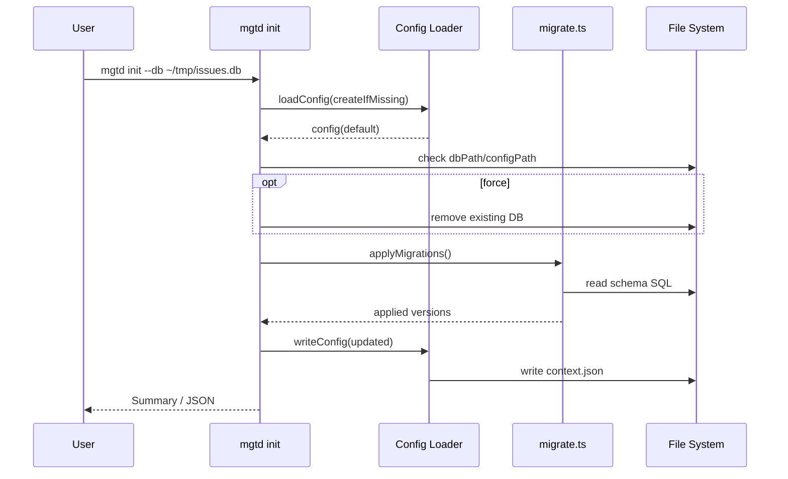

# Issues CLI 要件定義（GitHubオマージュ）

---

## 1. 概要

* CLI と API を共通データ構造で扱う単一ユーザー用アプリケーション。
* `memo` と `task` は**CLIサブコマンドとして分離**される。
* 内部データは単一テーブル `issues` に統合し、`type` に `memo` / `task` を格納。
* IDは単一連番。GitHubの `issue` / `pr` と同様に内部構造は共通だがCLI階層は分離する。
* ローカルDB（SQLite）とWeb API（OpenAPI準拠）を切り替え可能。
* メモからタスクへの昇格は無制限。`is_promoted` フラグは持たない。

---

## 2. CLI構成

### コマンドツリー

```
app
 ├─ init
 ├─ memo
 │   ├─ create
 │   ├─ list
 │   ├─ view
 │   ├─ edit
 │   ├─ delete
 │   ├─ promote
 │   ├─ bookmark
 │   ├─ unbookmark
 │   └─ comment (add|edit|delete)
 ├─ task
 │   ├─ create
 │   ├─ list
 │   ├─ view
 │   ├─ edit
 │   ├─ close|cancel|reopen|delete
 │   ├─ bookmark
 │   ├─ unbookmark
 │   └─ comment (add|edit|delete)
 ├─ label (list|add|set|delete)
 ├─ project (create|add|move)
 ├─ link (add)
 └─ context (set|show)
```

### サブコマンド方針

* `memo` と `task` は別系統で動作。
* CLI内部では `type='memo'` または `type='task'` を自動付与。
* `memo promote` のみが新しい `task` を生成する。
* IDは全体で共通連番。異なる型での参照はエラーとする。

### グローバルオプション（`mgtd` 共通）

| オプション | 既定値 | 説明 |
| ---------- | ------ | ---- |
| `--config PATH` | `~/.config/mgtd/context.json` | ローカル SQLite 接続設定を読み込むファイル。 |
| `--json FIELDS` | なし | JSON 出力。`FIELDS` は `gh` と同様のフィールド指定。省略時は全件。必須提供。 |
| `--template STRING` | なし | Go テンプレート形式での出力カスタマイズ。 |
| `--editor` | `$EDITOR` 検出 | 入力プロンプトでエディタを起動させる。 |
| `--help` / `-h` | - | ヘルプメッセージ表示。 |
| `--version` | - | バージョン表示。 |

### 共通UI / 入出力ポリシー

* 一覧系はデフォルトで表形式。`--json` 指定で機械可読出力、`--template` で任意整形。
* 本文入力は `$EDITOR` を既定で起動。`--body`, `--body-file`, `--editor` の組み合わせは `gh issue` と同一挙動。
* `--body-file -` により標準入力からの取り込みを許可。
* すべての `list` / `view` 系コマンドは `--json` を提供し、CLI テストのため `--limit`, `--search` を実装。
* 破壊的操作（`delete`, `close` など）は確認プロンプトを表示し、`--yes` でスキップ可能（`gh` 準拠）。

### メモコマンド・シーケンス図

```mermaid
sequenceDiagram
  participant U as User
  participant CLI as mgtd CLI
  participant CFG as Config Loader
  participant DB as SQLite (memoRepository)
  participant CORE as MemoService

  U->>CLI: mgtd memo create --label idea
  CLI->>CFG: loadConfig()
  CFG-->>CLI: MgtdConfig
  CLI->>CORE: MemoService#create(body, labels)
  CORE->>DB: createMemo() + attachLabels()
  DB-->>CORE: Memo record
  CORE-->>CLI: Memo DTO
  CLI-->>U: Created memo #ID

  U->>CLI: mgtd memo promote <id> --title …
  CLI->>CFG: loadConfig()
  CLI->>CORE: MemoService#promote()
  CORE->>DB: getMemo(); insert task; insert link
  DB-->>CORE: {memo, taskId}
  CORE-->>CLI: Promotion result
  CLI-->>U: Promoted memo -> task
```



### サブコマンド詳細

#### init

* 目的: ローカル SQLite データベースと基本設定ファイルを初期化する。
* 処理内容:
  - 指定パス（既定 `~/.issues.db`）に SQLite ファイルを作成し、最新スキーマを適用。
  - `~/.config/mgtd/context.json` が未作成の場合、指定 DB パスを指す設定ファイルを生成。
  - 既存ファイルがある場合は安全のため失敗し、`--force` 指定時のみ上書え（バックアップは利用者責任）。
* オプション:

| オプション | 説明 |
| ---------- | ---- |
| `--db PATH` | 作成する SQLite ファイルの場所を明示。ディレクトリが存在しない場合は作成。 |
| `--force` | 既存 DB を削除して再作成。 |
| `--dry-run` | 実際には書き込まず、作成対象と適用予定スキーマを表示。 |

* 出力: 標準出力に DB パスとスキーマバージョンを表示。`--json` 指定時は `{dbPath, schemaVersion, configPath}` を返す。

#### memo

`memo` は Captured（メモプール）を管理する。全コマンドで `issues.type = memo` を自動フィルタし、ID が `task` の場合は型不一致エラーを返す。

##### memo create

* 目的: アイデアを即時記録し Captured プールに追加。
* 入出力: 標準出力に作成結果（ID と本文冒頭）を表示。`--json` では `id`, `number`, `body`, `labels`, `url`, `createdAt` 等を返す。
* 既定挙動: `$EDITOR` を起動し、本文を Markdown で入力する。`--body` 指定で本文を直接渡す。
* オプション（`gh issue create` 準拠）:

| オプション | 必須 | 説明 |
| ---------- | ---- | ---- |
| `--body STRING` | 任意 | 本文を直接指定。 |
| `--body-file PATH` | 任意 | ファイルから本文を読み込み。`-` で STDIN。 |
| `--editor` / `--no-editor` | 任意 | 強制的に `$EDITOR` を起動/抑止。 |
| `--label NAME[,NAME...]` | 任意 | 既存ラベルを関連付け。複数指定可。 |
| `--project NAME` | 任意 | プロジェクトへ同時追加。 |
| `--json FIELDS` | 任意 | JSON 出力。 |

* バリデーション: 本文は必須（空の場合はエラー）。存在しないラベル/プロジェクト指定時はエラー。

##### memo list

* 目的: Captured プールを検索・一覧表示。
* 既定ソート: `updated_at` 降順。削除フラグ付きは除外。
* オプション:

| オプション | 説明 |
| ---------- | ---- |
| `--limit N` | 取得件数。既定 30。 |
| `--label NAME` | 指定ラベルを持つメモのみ。複数指定可。 |
| `--search QUERY` | 本文のフリーテキスト検索（FTS5 利用）。 |
| `--order {asc|desc}` | ソート順。既定 `desc`。 |
| `--bookmarked` | ブックマーク済みメモのみ表示。 |
| `--json FIELDS` | JSON 出力。 |
| `--template STRING` | カスタム表示。 |

* 出力: 既定は表形式（ID, Preview, Updated, Labels, Bookmark）。`--json` は `[{id, number, body, updatedAt, labels, isBookmarked}]`。
| `--json FIELDS` | JSON 出力。 |
| `--template STRING` | カスタム表示。 |

* 出力: 既定は表形式（ID, Preview, Updated, Labels）。`--json` は `[{id, number, body, updatedAt, labels}]`。

##### memo view

* 目的: 単一メモの内容を表示。
* 既定表示: Markdown をレンダリングせずプレーン表示。`--comments` でコメント同時表示。
* オプション: `--json`, `--template`, `--comments`。
* エラー: 指定 ID が `task` の場合は `対象IDは別種別です`。

##### memo edit

* 目的: 既存メモの本文・ラベル・プロジェクトを更新。
* 入力方法: `$EDITOR` を起動。`--body`, `--add-label`, `--remove-label`, `--project` をサポート（`gh issue edit` 換算）。
* 編集履歴: 本文・コメントは `comment_revisions` に保存。
* `--json` 指定時は更新後のレコードを返す。

##### memo delete

* 目的: メモを論理削除（`is_deleted = true`）する。
* 既定挙動: 対話的な確認プロンプトを表示。
  - メモIDと内容プレビュー（最初の60文字、最初の行のみ）を表示
  - `Delete memo #<id>: "<preview>"? (y/n):` と入力を求める
  - `y` / `yes` で削除実行、`n` / `no` でキャンセル（大文字小文字を区別しない）
  - 無効な入力時はエラーメッセージを表示してキャンセル
  - Ctrl+C で優雅にキャンセル（終了コード130）
* オプション:

| オプション | 説明 |
| ---------- | ---- |
| `--yes` / `-y` | 確認プロンプトをスキップして即座に削除（自動化・スクリプト用）。 |
| `--json` | JSON出力: `{id, deleted: true}`。 |

* 非TTY環境（パイプ、リダイレクト）: `--yes` フラグが必須。フラグなしの場合はエラーメッセージを表示。
* 論理削除。`is_deleted = true`。`--yes` で確認省略。
* `--json` では `{id, deleted: true}` を返却。

##### memo promote

* 目的: メモをタスクに昇格し、Inbox に送る。
* 入力: 元メモ ID。`--title`, `--body`, `--label`, `--project`, `--assignee`, `--milestone` 等 `task create` 相当を委譲。
* 挙動:
  - 新規 `issues.type = task` を作成（初期 `status=open`）。
  - `links` に `derived_from` を追加。
  - 生成タスクを `task view` で表示し、元メモは Captured に残す。
* `--json` で新タスクを返却。

##### memo comment

* `memo comment add`: `--body`, `--body-file`, `$EDITOR` 起動可。
* `memo comment edit`: コメント ID 指定で本文を更新、履歴保存。
* `memo comment delete`: 論理削除。`--yes` 対応。
* `--json` はコメントエンティティを返却。

##### memo bookmark

* 目的: メモにブックマークを付けて優先アクセスを可能にする。
* 入力: メモ ID（必須）。
* 挙動: 対象メモの `is_bookmarked` を `true` に設定。既にブックマーク済みでもエラーにせず成功（冪等性）。
* 出力: 標準出力にブックマーク設定完了メッセージ。`--json` では `{id, isBookmarked: true}` を返す。

##### memo unbookmark

* 目的: メモからブックマークを外す。
* 入力: メモ ID（必須）。
* 挙動: 対象メモの `is_bookmarked` を `false` に設定。ブックマークされていなくてもエラーにせず成功（冪等性）。
* 出力: 標準出力にブックマーク解除完了メッセージ。`--json` では `{id, isBookmarked: false}` を返す。


#### task

* 役割: Inbox〜実行フェーズを管理。`memo promote` 由来または `task create` で直接生成。
* `task create`: `gh issue create` 相当のオプションに加え、`--status` 初期値指定、`--scheduled-on DATE` を独自追加。
* `task list`: `--status`, `--label`, `--project`, `--assignee`, `--limit`, `--bookmarked`, `--json`。
  - `--bookmarked`: ブックマーク済みタスクのみ表示。
* `task edit`: `--title`, `--body`, `--status`, `--scheduled-on`, `--add-label`, `--remove-label`, `--project`。
* `task close|cancel|reopen`: ステータス遷移。`--comment` で理由コメントを同時追加可。
* `task bookmark`: タスクにブックマークを設定（冪等）。
* `task unbookmark`: タスクからブックマークを解除（冪等）。
* `task list`: `--status`, `--label`, `--project`, `--assignee`, `--limit`, `--json`。
* `task edit`: `--title`, `--body`, `--status`, `--scheduled-on`, `--add-label`, `--remove-label`, `--project`。
* `task close|cancel|reopen`: ステータス遷移。`--comment` で理由コメントを同時追加可。
* コメント・ラベル操作は `memo` と同等。

#### label

統合ラベル管理コマンド。memo/taskから独立してラベルを管理する。

##### label list

* 目的: システム内の全ラベルを一覧表示する。
* 入力: なし。
* 出力: 既定はラベル名を1行ずつ表示。`--json` では `[{id, name, description, createdAt}]` 形式。
* オプション:

| オプション | 説明 |
| ---------- | ---- |
| `--json` | JSON配列形式で出力。 |

##### label add

* 目的: 新しいラベルを作成する。
* 入力: ラベル名（必須）。`--description` で説明を追加可能。
* 出力: 既定は `Label '<name>' created`。`--json` では作成されたLabelオブジェクト。
* バリデーション: ラベル名は一意（case-sensitive）。重複時はエラー `Label '<name>' already exists`。
* オプション:

| オプション | 説明 |
| ---------- | ---- |
| `--description`, `-d STRING` | ラベルの説明を追加。 |
| `--json` | JSON形式で出力。 |

##### label set

* 目的: issueにラベルを割り当てる（memo/task両対応）。
* 入力: `<issue-id>` と `<label-id>`（両方必須）。
* 挙動: 対象issueにラベルを追加。冪等性あり（重複割り当てエラーなし）。
* 出力: 既定は `Label assigned to issue #<id>`。`--json` では `{issue_id, label_id, assigned_at}`。
* エラー:
  - Issue不存在: `Issue #<id> not found`
  - Issue削除済み: `Issue not found or deleted`
  - Label不存在: `Label #<id> not found`
* オプション:

| オプション | 説明 |
| ---------- | ---- |
| `--json` | JSON形式で出力。 |

##### label delete

* 目的: ラベルを削除する（CASCADE削除）。
* 入力: ラベル名（必須）。
* 挙動: 指定ラベルを削除。関連する `issue_labels` も自動削除（CASCADE）。
* 出力: 既定は `Label '<name>' deleted`。`--json` では `{name, deleted: true}`。
* エラー: 存在しないラベル指定時は `Label '<name>' not found`。
* オプション:

| オプション | 説明 |
| ---------- | ---- |
| `--json` | JSON形式で出力。 |

#### project / link / context

* `project create`: GitHub Projects 互換（名前、`--view board|table`、`--json`）。`project add` で issue を列に配置（`--column` 指定）。`project move` は既存アイテムの並び替え。
* `link add`: `--type {parent,child,relates,derived_from}`、`--target ID`。`memo promote` 以外でも任意リンクを許可。
* `context set`: `context set --db PATH` でローカル SQLite のファイルパスを登録。設定後は `context show` で確認でき、`--json` で現在値を返す。

---

## 3. データ構造

### issues（単一テーブル）

| カラム                     | 型                   | 必須 | 説明                                                               |
| ----------------------- | ------------------- | -- | ---------------------------------------------------------------- |
| id                      | int                 | 必須 | 全レコード共通連番                                                        |
| type                    | enum(`memo`,`task`) | 必須 | レコード種別                                                           |
| title                   | string?             | 任意 | メモでは常にNULL、タスクでは必須                                            |
| body_md                 | string              | 必須 | 本文（Markdown）                                                     |
| status                  | enum?               | 任意 | taskでのみ使用（`open`,`next`,`waiting`,`scheduled`,`done`,`canceled`） |
| scheduled_on            | date?               | 任意 | 予定日（task中心）                                                      |
| meta                    | json                | 任意 | 補足情報                                                             |
| created_at / updated_at | datetime            | 必須 | タイムスタンプ                                                          |
| is_bookmarked           | boolean             | 必須 | 既定false                                                          |
| is_deleted              | boolean             | 必須 | 論理削除（既定false）                                                    |

### labels / issue_labels

* `labels`: `id`, `name`, `description?` （色なし）
* `issue_labels`: 中間テーブル（多対多）

### comments / comment_revisions

* コメント編集・履歴管理に対応。
* `comment_revisions` は編集前スナップショットを保持。

### links

* `link_type`: `parent` / `child` / `relates` / `derived_from`
* メモ昇格時は `derived_from` リンクを追加。

### projects / project_items

* Issueをプロジェクト単位に配置。
* `project_items` に並び順 (`position`) とUI情報 (`view_meta`) を保持。

---

## 4. ID・整合ルール

* すべてのレコードに単一連番 `id`。
* CLI入力IDに対して `type` を検証。

  * 例: `memo view 34` 実行時、対象が `task` ならエラーを返す。
* 表示上は `#12` や `M#12` `T#45` のように表記可能。

---

## 5. 挙動・制約

* `memo promote`：新しい `task` を作成。リンクは `derived_from`。
* `task close|cancel|reopen`：`status` を変更。
* `delete`：`is_deleted=true` にする論理削除。
* `edit`：`memo` では本文・ラベル・プロジェクトなど、`task` ではタイトル・本文・status・scheduled_on の更新を許可。
* `comment edit`：編集履歴を残す。

---

## 6. バックエンド運用

- CLI `mgtd` はローカル SQLite に固定。実行時は `~/.config/mgtd/context.json`（または `--config` 指定ファイル）から接続先パスを読み込む。
- リモート Web API は別プロセス／別クライアント向けであり、CLI から直接呼び出さない。

### Contextコマンド

* `context set --db ~/.issues.db`
* `context show`

---

## 7. API設計（OpenAPI連携）

* APIエンドポイントは `/issues`（共通）を使用し、CLIが `type` を付与。
* コメント編集は `PATCH /comments/{id}`。
* ラベル追加／置換／削除は `POST`／`PUT`／`DELETE /issues/{id}/labels`。
* メモ昇格は `POST /issues/{id}/promote`。

---

## 8. 一貫性ルール

* DBとAPIは共通スキーマを保持。
* ローカル・リモートの同期は `updated_at` 比較により行う。
* `is_deleted` と `updated_at` によるトゥームストーン戦略を採用。
* リモートAPIの権威は連番ID。ローカル新規は一時IDで作成し、同期時に確定。

---

## 9. 例外・エラー設計

* 型不一致：`対象IDは別種別です` エラー。
* 存在しないID：`対象が存在しません`。
* バックエンド不明：`backend指定またはcontext設定が必要です`。
* リモート通信失敗：`API unreachable`（オフライン時にlocal fallback）。

---

## 10. 同期仕様

- CLI はローカル SQLite のみを対象とするため、local ⇄ remote 同期機能は提供しない。

---

## 11. 表示規約

* CLI出力：表形式（デフォルト）、`--json` でJSON出力。
* UI上：GitHub風タイムライン（コメント・昇格履歴・状態変更をイベント表示）。

---

## 12. 非機能要件

* 単一ユーザー・ローカルファースト設計。
* DB操作・API呼び出しは即時反映。
* CLI補完（fish/zsh）を提供。
* FTS検索対応（SQLite FTS5）。

---

## 13. 想定ユースフロー

1. `memo create -F idea.md`
2. `memo list`
3. `memo promote 12 --title "買い物" --label shopping`
4. `task list --label shopping`
5. `task close 34`
6. `context set --db ~/.issues.db`
7. `task list --status open`

---

## 14. 目的の整合

* GitHubのCLI構造を踏襲しつつ、個人のタスク・メモ管理を最小構成で実現する。
* CLI と API が同一データモデルで連携できるように設計する。
* 一貫した `issues` テーブルでメモとタスクの相互運用を担保する。
