# データモデル（ER図）

> 目的: 現行DBスキーマの全テーブル・カラム・関係と、enum値などの意味層を一箇所で示す（データモデルの正）
> 読むタイミング: DBスキーマ・型・リポジトリ・APIレスポンスの構造に触れる前
> 更新タイミング: `schema/` にマイグレーションを追加したとき（db-migration スキルのチェックリストに含まれる）

`schema/` 配下の SQL マイグレーションを反映した、現行スキーマの ER 図です。カラム定義の最終的な正は `schema/*.sql`。

- 中心テーブルは `issues` （memo / task / article / template を 1 つのテーブルで管理）。
- `issues_fts` は FTS5 仮想テーブル、`schema_migrations` はマイグレーション履歴、`sync_state` は単一行のメタテーブルのため独立。
- `activity_log` は payload(JSON) から仮想カラムで `issue_id` 等を参照するイベントソース型。**外部キー制約は持たない**ため、論理的な関係を点線（破線）で示しています。
- `sync_sequence` / `sync_tombstones` / `sync_applied_ops` と `uuid` / `server_seq` カラムは iOS オフライン同期の基盤（migration 014、意味は後述の「同期基盤」）。

```mermaid
erDiagram
    issues {
        INTEGER  id PK
        TEXT     uuid UK "sync identity"
        INTEGER  server_seq "sync cursor"
        TEXT     type "memo|task|article|template"
        TEXT     title
        TEXT     body_md
        TEXT     status
        TEXT     scheduled_on
        TEXT     meta "JSON"
        TEXT     created_at
        TEXT     updated_at
        INTEGER  is_bookmarked
        INTEGER  is_deleted
        TEXT     start_time
        TEXT     end_time
        INTEGER  duration
        TEXT     end_date
        TEXT     scheduled_start
        TEXT     scheduled_end
        INTEGER  is_all_day
        TEXT     actual_start
        TEXT     actual_end
        TEXT     task_kind "event|action"
        TEXT     template_target "task|article (template only)"
        TEXT     origin "web|manual (article only)"
    }

    labels {
        INTEGER  id PK
        TEXT     name UK
        TEXT     description
        TEXT     created_at
        INTEGER  server_seq "sync cursor"
    }

    issue_labels {
        INTEGER  issue_id PK,FK
        INTEGER  label_id PK,FK
        TEXT     assigned_at
        INTEGER  server_seq "sync cursor"
    }

    comments {
        INTEGER  id PK
        TEXT     uuid UK "sync identity"
        INTEGER  server_seq "sync cursor"
        INTEGER  issue_id FK
        TEXT     body_md
        TEXT     created_at
        TEXT     updated_at
        INTEGER  is_deleted
    }

    comment_revisions {
        INTEGER  id PK
        INTEGER  comment_id FK
        TEXT     body_md
        TEXT     created_at
    }

    links {
        INTEGER  id PK
        INTEGER  source_issue_id FK
        INTEGER  target_issue_id FK
        TEXT     link_type "parent|child|relates|derived_from"
        TEXT     created_at
    }

    projects {
        INTEGER  id PK
        TEXT     name UK
        TEXT     description
        TEXT     created_at
        TEXT     view_meta "JSON"
        TEXT     status "planned|active|paused|done|canceled"
        TEXT     start_date
        TEXT     end_date
    }

    project_items {
        INTEGER  id PK
        INTEGER  project_id FK
        INTEGER  issue_id FK
        REAL     position
        TEXT     view_meta "JSON"
        TEXT     created_at
        TEXT     updated_at
    }

    url_links {
        INTEGER  id PK
        INTEGER  issue_id FK
        TEXT     url
        TEXT     title
        TEXT     created_at
    }

    issue_embeddings {
        INTEGER  issue_id PK,FK
        BLOB     embedding
        TEXT     model
        INTEGER  dimensions
        TEXT     content_hash
        TEXT     created_at
        TEXT     updated_at
    }

    activity_log {
        INTEGER  id PK
        TEXT     event_type
        TEXT     occurred_at
        TEXT     source_type "cli|api|system"
        TEXT     payload "JSON"
        INTEGER  issue_id   "virtual: payload.issue_id"
        INTEGER  project_id "virtual: payload.project_id"
        INTEGER  label_id   "virtual: payload.label_id"
        INTEGER  link_id    "virtual: payload.link_id"
        INTEGER  comment_id "virtual: payload.comment_id"
    }

    sync_state {
        INTEGER  id PK "= 1"
        TEXT     last_synced_at
        TEXT     schema_version
    }

    sync_sequence {
        INTEGER  id PK "= 1"
        INTEGER  seq "global monotonic counter"
    }

    sync_tombstones {
        INTEGER  id PK
        TEXT     entity "label|issue_label"
        TEXT     entity_key "JSON"
        INTEGER  server_seq
        TEXT     deleted_at
    }

    sync_applied_ops {
        TEXT     op_id PK "client-generated"
        TEXT     device_id
        TEXT     result
        TEXT     applied_at
    }

    schema_migrations {
        TEXT     version PK
        TEXT     applied_at
    }

    issues_fts {
        INTEGER  issue_id "UNINDEXED, FTS5"
        TEXT     title
        TEXT     body_md
    }

    %% --- 外部キーで結ばれる強い関係 ---
    issues            ||--o{ issue_labels      : "tagged with"
    labels            ||--o{ issue_labels      : "applied to"
    issues            ||--o{ comments          : "has"
    comments          ||--o{ comment_revisions : "revised by"
    issues            ||--o{ links             : "source of"
    issues            ||--o{ links             : "target of"
    projects          ||--o{ project_items     : "contains"
    issues            ||--o{ project_items     : "appears in"
    issues            ||--o{ url_links         : "has"
    issues            ||--o| issue_embeddings  : "vectorized as"

    %% --- トリガで同期される論理関係 ---
    issues            ||..o{ issues_fts        : "synced by trigger"

    %% --- activity_log は payload(JSON) 経由の弱参照（FK 制約なし） ---
    issues            ||..o{ activity_log      : "logged in (payload.issue_id)"
    projects          ||..o{ activity_log      : "logged in (payload.project_id)"
    labels            ||..o{ activity_log      : "logged in (payload.label_id)"
    links             ||..o{ activity_log      : "logged in (payload.link_id)"
    comments          ||..o{ activity_log      : "logged in (payload.comment_id)"
```

## enum値と意味層

### issues

- `type`: `memo` / `task` / `article` / `template`（010 で `article`、015 で `template` 追加）
- `template_target`（templateのみ）: `task` / `article`。そのテンプレートが生成する型。作成時に選ぶ。template 以外では NULL（migration 015）
- `origin`（articleのみ）: `web` / `manual`。Web保存か手動作成かを表し、article 以外では NULL（migrations 016–017）
- `status`（taskのみ使用）: `inbox` / `open` / `next` / `waiting` / `scheduled` / `someday` / `done` / `canceled` の8値。memoでは未使用（NULL）
- `task_kind`（taskのみ）: `event`（予定）/ `action`（作業、デフォルト）
- `title`: task/articleは必須。memoは常にNULL（未使用）
- `meta`（JSON）: Web保存 article は `originalUrl` / `siteName` / `archivedAt` を保持。手動 article では `originalUrl` を持たない
- `is_bookmarked` / `is_deleted`: 0/1フラグ。削除は論理削除
- 日時カラムはISO 8601文字列

### スケジュールフィールドの新旧

| 区分 | カラム |
|---|---|
| 新形式（現行。新規コードはこちら） | `scheduled_start`, `scheduled_end`, `is_all_day`, `actual_start`, `actual_end`, `notify_before_minutes` |
| 旧形式（非推奨。後方互換のため残存） | `scheduled_on`, `end_date`, `start_time`, `end_time`, `duration` |

### links

- `link_type`: `parent` / `child` / `relates` / `derived_from`
- `derived_from` は memo→task 昇格時に張られ、元メモとの追跡に使う
- `relates` は本文・コメント内の `#id` メンションから自動作成される（詳細: `docs/architecture.md` 設計意図）

### projects

- `status`: `planned` / `active` / `paused` / `done` / `canceled`（migration 006）
- `start_date <= end_date` を強制するトリガ（`trg_projects_start_end_check_*`）あり

### activity_log（イベントソーシング）

- Append-only: migration 009 のトリガで UPDATE / DELETE を禁止
- 固定カラムは `event_type`, `occurred_at`, `source_type`（`cli`/`api`/`system`）, `payload` のみ。`issue_id` 等は `json_extract(payload, '$.xxx')` による VIRTUAL Generated Column（物理FKなし、ER図上は破線）
- Diff Logging: 更新系イベントは `{ old, new }` 形式で変更前後を記録
- Snapshotting: イベント発生時点の関連エンティティ名を焼き付け
- イベントタイプ:
  - Task: `task.created`, `task.updated`, `task.status_changed`, `task.deleted`, `task.bookmarked`
  - Memo: `memo.created`, `memo.updated`, `memo.promoted`, `memo.deleted`, `memo.bookmarked`
  - Project: `project.created`, `project.updated`, `project.deleted`, `project.item_added`, `project.item_removed`
  - Label: `label.created`, `label.deleted`, `label.assigned`, `label.removed`
  - Link: `link.created`, `link.deleted`
  - Comment: `comment.created`, `comment.updated`, `comment.deleted`
  - Search: `search.exported`（`POST /api/search/export`）

### issue_embeddings（セマンティック検索）

- `embedding`: Float32Array のBLOB。title + body_md + comments 全体から生成
- `model`: 使用モデル名（例: `qwen3-embedding:4b`）、`dimensions`: ベクトル次元数
- `content_hash`: SHA-256。内容が変わったissueのみ再生成するための変更検知
- オプトイン機能: `mgtd embedding sync` 実行後のみ populated

### 同期基盤（migration 014、iOS オフライン同期）

- `uuid`（issues / comments）: 同期用の恒久ID。オフラインクライアントが採番できるようUUIDを採用。新規行はリポジトリがUUIDv7を生成し、リポジトリを経由しないINSERTにもトリガがUUIDv4をフォールバック付与する。labelsは `name` が自然キーのためuuidなし
- `server_seq`（issues / comments / labels / issue_labels）: 全書き込みに振られるグローバル単調連番。差分取得のカーソル（`?since=<seq>`）として使う。カウンタは `sync_sequence`（`id = 1` のシングルトン）
- **打刻はSQLiteトリガ**（`*_sync_ai` / `*_sync_au` / `*_sync_ad`）で行う。CLIはHTTPを通らず core→db 直書きのため、全書き込み経路をカバーできる層がトリガのみであることが理由
- `sync_tombstones`: ハード削除される labels / issue_labels の削除記録。`entity_key` はJSONで整数IDと（解決できる場合）`labelName` / `issueUuid` を併記。CASCADE削除時は親の labels 行が先に消えるため `labelName` がNULLになる（クライアントは同時に出る `label` tombstone で補完する）。issues / comments は論理削除（`is_deleted`）自体がtombstoneを兼ねるため対象外
- `sync_applied_ops`: 同期push（Phase 2で追加予定の `POST /api/sync/push`）の冪等性台帳。`op_id` はクライアント採番
- 既存の `sync_state`（001由来・未使用）は別用途のため据え置き

### その他の制約

- `issue_labels` / `project_items` は中間テーブル。`project_items` は `(project_id, issue_id)` で UNIQUE
- `sync_state` は `id = 1` の1行のみを許可するシングルトン
- `issues_fts` は `issues.title`, `issues.body_md` に対するFTS5仮想テーブル。`issues_ai` / `issues_ad` / `issues_au` トリガで自動同期（用途と使い分けは `docs/architecture.md` 検索アーキテクチャ）
