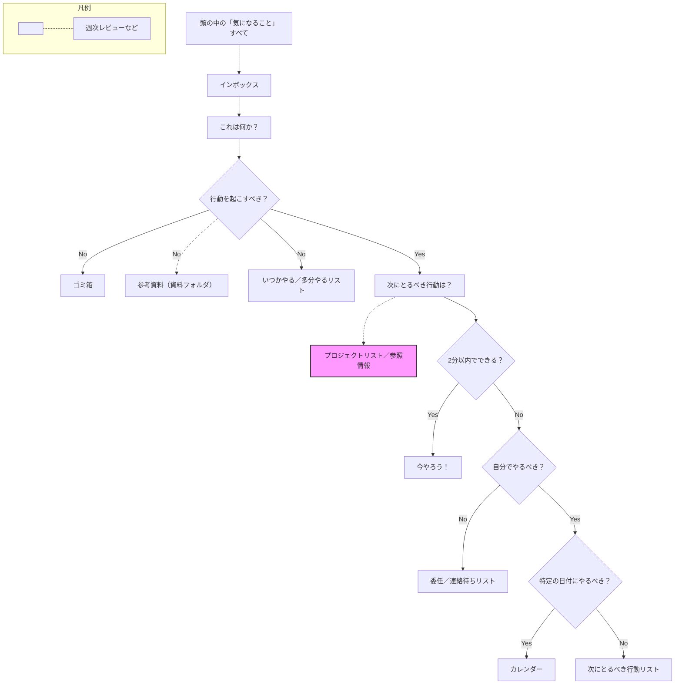
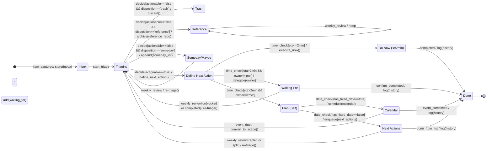

```mermaid
graph TD
    A[頭の中の「気になること」すべて] --> B[インボックス]
    B --> C[これは何か？]
    C --> D{行動を起こすべき？}

    %% 行動不要（No）の分岐
    D -- No --> T[ゴミ箱]
    D -- No --> R[参考資料（資料フォルダ）]
    D -- No --> S[いつかやる／多分やるリスト]

    %% 行動必要（Yes）の流れ
    D -- Yes --> E[次にとるべき行動は？]

    %% プロジェクト化（参考：図の左側注記）
    E -.-> P[プロジェクトリスト／参照情報]

    E --> F{2分以内でできる？}
    F -- Yes --> N[今やろう！]

    F -- No --> G{自分でやるべき？}
    G -- No --> W[委任／連絡待ちリスト]
    G -- Yes --> H{特定の日付にやるべき？}
    H -- Yes --> Cale[カレンダー]
    H -- No --> NA[次にとるべき行動リスト]

    subgraph legend [凡例]
        direction LR
        box1[ ]-.-box2[週次レビューなど]
    end

    linkStyle 4 stroke-dasharray: 5, 5
    style P fill:#f9f,stroke:#333,stroke-width:2px
```

```mermaid
stateDiagram-v2
    direction LR

    [*] --> Inbox : item_captured/ store(inbox)

    state "Triaging" as TRI
    Inbox --> TRI : start_triage

    %%--- 非アクション系の分岐 ---
    TRI --> Trash      : decide[actionable==false && disposition=='trash'] / discard()
    TRI --> Reference  : decide[actionable==false && disposition=='reference'] / archive(reference_repo)
    TRI --> Someday    : decide[actionable==false && disposition=='someday'] / append(someday_list)

    %%--- アクション系の分岐 ---
    TRI --> DefineNA   : decide[actionable==true] / define_next_action()

    state "Define Next Action" as DefineNA
    DefineNA --> DoNow     : time_check[eta<=2min] / execute_now()
    DefineNA --> Delegate  : time_check[eta>2min && owner!='me'] / delegate(owner); add(waiting_for)
    DefineNA --> PlanSelf  : time_check[eta>2min && owner=='me']

    state "Plan (Self)" as PlanSelf
    PlanSelf --> Calendar  : date_check[has_fixed_date==true] / schedule(calendar)
    PlanSelf --> Next      : date_check[has_fixed_date==false] / enqueue(next_actions)

    %%--- 終端系（各リスト/状態）---
    state "Trash" as Trash
    state "Reference" as Reference
    state "Someday/Maybe" as Someday
    state "Waiting For" as Delegate
    state "Next Actions" as Next
    state "Calendar" as Calendar
    state "Do Now (<=2min)" as DoNow
    state "Done" as Done

    %%--- レビュー駆動の循環 ---
    Someday --> TRI   : weekly_review / re-triage()
    Reference --> Reference : weekly_review / noop
    Delegate --> TRI  : weekly_review[unblocked or completed] / re-triage()
    Next --> TRI      : weekly_review[replan or split] / re-triage()
    Calendar --> TRI  : event_due / convert_to_action()

    %%--- 完了 ---
    DoNow --> Done : completed / log(history)
    Next --> Done  : done_from_list / log(history)
    Calendar --> Done : event_completed / log(history)
    Delegate --> Done : confirm_completed / log(history)
    Done --> [*]
```

